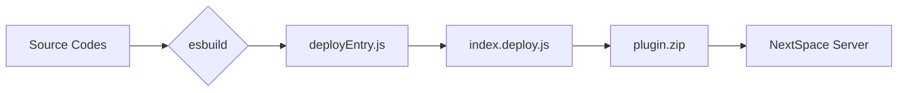

# NextSpace FEMS 플러그인 프로젝트 아키텍처

이 문서는 현대 트랜시스 FEMS 대시보드 플러그인의 전체 구조와 시스템 설계를 설명합니다.

---

## 1. 개요 (Overview)

본 플러그인은 NextSpace Navigator 내에서 동작하는 **고성능 대시보드 시스템**입니다. 
단일 파일 배포 제약 조건 내에서도 **모듈화된 개발**과 **실시간 코드 반영**이 가능하도록 설계된 **하이브리드 로더(Hybrid Loader)** 아키텍처를 기반으로 합니다.

---

## 2. 하이브리드 로더 시스템 (The Multi-Mode Loader)

`plugin/index.js`는 실행 환경을 자동으로 감지하여 최적의 코드를 로드합니다.

1.  **Development Mode (개발)**:
    - 로컬호스트(`http://localhost:8080`)에 연결을 시도합니다.
    - 성공 시, `plugin.js`를 동적으로 불러와 실시간 수정을 즉시 확인할 수 있습니다.
2.  **Standalone Mode (고정)**:
    - 개발 서버가 없으면 로컬 `dist/index.bundle.js`를 로드합니다.
    - 배포 전, 로컬에서 서버 없이 최종 확인을 할 때 사용됩니다.
3.  **Production Mode (실제 배포)**:
    - `deploy.py`를 통해 모든 코드가 `index.js` 하나로 합쳐져 배포됩니다.
    - 외부 의존성 없이 NextSpace 환경에서 독립적으로 실행됩니다.

---

## 3. 핵심 디렉토리 구조 (Directory Structure)

### 📂 `plugin/` (소스 코드)
- `index.js`: 시스템의 입구. 환경 감지 및 로딩을 담당합니다.
- `core.js`: **[핵심]** UI 렌더링, 상태 관리, 이벤트 바인딩 로직이 담긴 중추입니다.
- `plugin.js`: 개발 모드용 엔트리 포인트입니다.
- `deployEntry.js`: 배포 시 번들러(`esbuild`)가 참조하는 배포용 엔트리 포인트입니다.

### 📂 `plugin/config/`
- `menuConfig.js`: 사이드바 메뉴, 탭 구조, 아이콘 등을 정의하는 중앙 설정 파일입니다.

### 📂 `plugin/components/`
- `layout/ExternalShell.js`: 대시보드의 기본 외형(사이드바, 헤더, 탭 바)을 정의합니다.
- `pages/`: 각 탭에 표시될 실제 콘텐츠 화면(Overview, Energy 등)들이 모듈로 분리되어 있습니다.

### 📂 `plugin/utils/`
- `WindowManager.js`: 독립 팝업창을 생성하고 관리하는 유틸리티입니다.
- `Logger.js`: 개발 및 디버깅용 로그 시스템입니다.

### 📂 `scripts/`
- `build-deploy-index.js`: 여러 개로 쪼개진 JS 파일들을 하나로 합쳐주는 빌드 스크립트입니다.

---

## 4. 데이터 흐름 (Data & Execution Flow)

1.  **초기화**: `index.js`가 실행되어 `Run` 함수를 호출합니다.
2.  **로딩**: 선택된 모드에 따라 `core.js`가 메모리에 로드됩니다.
3.  **설정 로드**: `menuConfig.js`를 읽어 현재 선택된 메뉴와 탭의 구조를 파악합니다.
4.  **UI 렌더링**: `ExternalShell`이 먼저 그려지고, 그 안에 `pages/` 컴포넌트 중 하나가 렌더링됩니다.
5.  **이벤트 루프**: 사이드바 클릭이나 탭 변경 시 `core.js`의 상태가 업데이트되며 필요한 부분만 다시 그립니다.

---

## 5. 배포 프로세스 (Deployment Pipeline)

1.  개발 완료 후 `py deploy.py` 실행
2.  `esbuild`가 `deployEntry.js`를 시작으로 연결된 모든 파일을 하나로 묶음
3.  단일 파일로 변환된 `index.js`를 포함하여 ZIP 압축
4.  API를 통해 지정된 플러그인 서버로 자동 업로드

---

문서 버전: 1.1 (2026-04-17)
작성자: Antigravity AI Assistant
